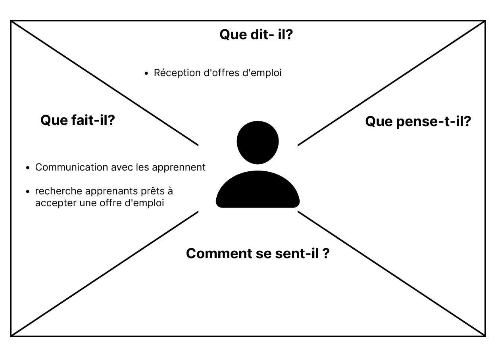

# Besoin 
## Empathie 

### Introduction

### Carte d'empathie administrateur

**Que dit- il?**
- `Réception` d'offres d'emploi

**Que fait-il?**
- `Communication` avec les apprennent
  -  Préparation d'une `liste` contenant les `noms des apprennent`.
  -  `Contact individuel` avec les apprennent, utilisant des moyens tels que l'e-mail ou le téléphone.
-  Étapes après la Communication 
Réception de deux réponses possibles de la part des apprennent.
  - a: `Acceptation` de l'Offre
    - `Arrêt` de la recherche pour cette opportunité.
    - `Confirmation` que l'apprenant occupe l'emploi.
  - b: `Rejet` de l'Offre 
    - `Proposition` de l'offre d'emploi à l'apprenant suivant sur la liste.  
    - `Répétitions` du processus jusqu'à ce qu'un apprenant accepte l'offre.
    - `Marquage` du nom de l'apprenant comme ayant rejeté l'offre.

### Définir le problème  

Dans le processus actuel de recherche et de sélection des apprenants pour les offres d'emploi, l'administration de l'école fait face à plusieurs défis majeurs.
- L'absence d'une base de données centralisée et facilement accessible sur l'emploi des apprenants rend difficile la distinction entre ceux qui ont déjà trouvé un emploi et ceux qui sont toujours à la recherche.
- Cette lacune entraîne des retards importants, car l'administration doit contacter chaque apprenant individuellement pour déterminer leur statut d'emploi. 
- De plus, la diversité des critères de recherche, tels que les compétences spécifiques ou la notoriété des apprenants, complique davantage le processus. Ces facteurs cumulatifs rendent la recherche et la sélection chronophages

### Idéation

- Pour optimiser le processus de recherche et de sélection des étudiants pour les offres d'emploi, l'école prévoit de développer une application Web dédiée. 
- Cette application fournira une interface conviviale dotée de fonctionnalités de filtrage, permettant un accès rapide et efficace aux informations pertinentes sur chaque étudiant. L'objectif principal de cette solution est de rationaliser le suivi des statuts d'emploi des étudiants, d'accélérer la communication individuelle et de faciliter la recherche ciblée basée sur des critères spécifiques tels que les compétences ou la notoriété des étudiants. La mise en œuvre de cette application vise à rendre le processus de sélection plus efficient et à répondre aux besoins dynamiques de la recherche d'emplois pour les étudiants de l'école.